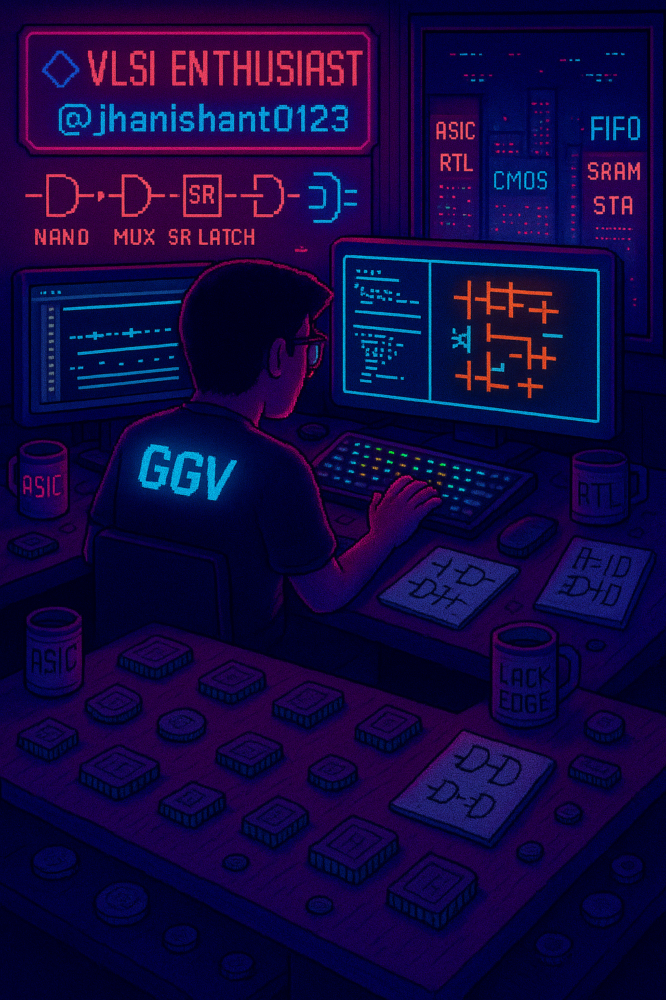

<h1 align="center">Hi 👋, I'm Nishant Kumar Jha</h1>
<h3 align="center">Final-Year ECE Undergrad | VLSI Frontend Enthusiast | RTL | DFT | STA</h3>

  
  
 

---
<!-- 🎯 Fancy Banner Header -->

  

## 🧠 About Me

🎓 Final-year B.Tech in Electronics & Communication Engineering  
🏛️ Guru Ghasidas Vishwavidyalaya, Bilaspur    
💡 VLSI-Driven | RTL-Focused | ASIC Design/Verification  

🔍 Passionate about:
- RTL Design, FSMs, STA, FIFO Architecture
- SRAM/RAM Design using Cadence
- Verilog System Modeling and Verification

🛠️ Tools of the Trade:
**Xilinx Vivado**, **Cadence Virtuoso**, **ModelSim**, **GTKWave**, **NI Multisim**

---

## 🚀 Highlight Projects

### 🔹 5-Stage Pipelined RISC-V CPU (RV32I)
- Hazard detection & forwarding logic
- Improved throughput by **35%**
- Simulated 5 core module along with its testbenches | 100% functional coverage  
➡️ [View Project](https://github.com/jhanishant0123/RISC-V-Based-5-Stage-Pipelined-Processor)

### 🔹 64-bit SRAM Memory Design
- Built with 6T cell in Cadence Virtuoso
- Full DRC/LVS-verified schematic + layout
- Simulated power, delay & noise margin

### 🔹 FIFO Design (Sync + Async)
- Optimized FIFO depth via system analysis
- Handled metastability and domain crossing
- Verified data integrity with waveform debugging

### 🔹 Dual/Single-Port RAM
- Designed in Verilog, simulated in Vivado
- Validated under various functional scenarios

---

## 💻 Technical Skills

| Area               | Tools & Technologies                                                                 |
|--------------------|---------------------------------------------------------------------------------------|
| 🧠 HDL Languages    | Verilog, basic SystemVerilog                                                         |
| 🧰 VLSI Tools       | Xilinx Vivado, Cadence Virtuoso, GTKWave, ModelSim, NI Multisim                      |
| 🏗️ Core Concepts   | FSMs, RTL Design, FIFO, SRAM, DFT, Static Timing Analysis                            |
| 💻 Programming      | C, C++, Python                                                                       |
| 🌐 Extras           | Git, Markdown, Linux(Basics), HTML/CSS (for personal projects)                          |

---

<h2>📊 GitHub Stats</h2>

  

   

   
  

---
## 📊 Contribution Graph

  

---

## 🏅 Profile Trophies

  

## 🔗 Explore More

- 📂 [My GitHub Projects](https://github.com/jhanishant0123?tab=repositories)  
- 📄 [Resume (View/Download)](https://drive.google.com/file/d/1NJPo7Qt06sDi8CZutqz6FoHfZTJdDD3u/view?usp=sharing)  
- 🌐 [Personal Portfolio Website](https://nishant-jha-portfolio.lovable.app/)

  

---<h3 align="left">Support:</h3>

  

> 🚀 *“Great chips come from clean code and clear timing.” – Nishant Jha*
